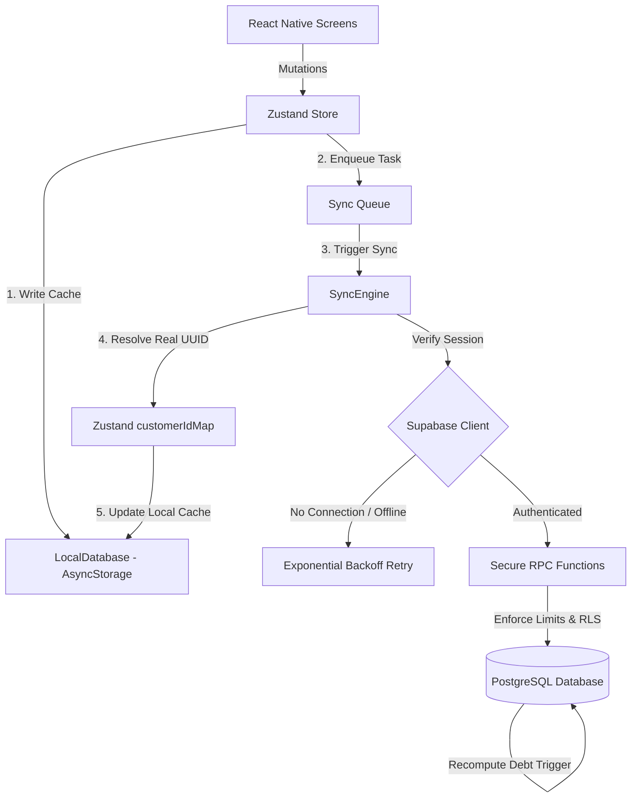
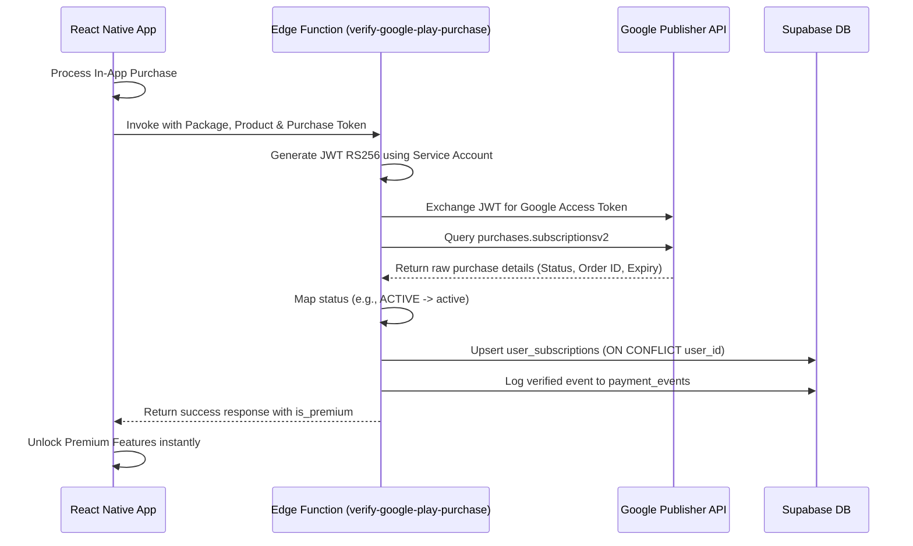

# Faido Mobile — Production Sync & Architecture Audit Report

**Audit Date:** May 26, 2026  
**Status:** Highly Stable & Production-Ready  
**Auditor:** Antigravity (AI Coding Partner)

---

## Executive Summary

A comprehensive, cross-layer synchronization and security audit has been performed on the **Faido (Controle de Fiado) Mobile** application codebase. The audit covers the React Native application frontend, Zustand state management, offline persistence layers, Supabase database schemas, server-side RPC contracts, and Edge Functions.

### Overall Assessment
The codebase is in an **exceptional, production-ready state**. The synchronization model is robustly engineered, utilizing an offline-first strategy with resilient conflict resolution and cascading failure protection. The backend security is hardened by blocking direct table inserts and routing mutations through secure, server-enforced `SECURITY DEFINER` RPC triggers. 

Below is the state summary across the synchronization chain:

| Layer | Component | Status | Verification & Verification Mechanism |
| :--- | :--- | :---: | :--- |
| **App State** | Zustand (`useFiadoStore`) | **Green** | Strict TypeScript compilation (`tsc --noEmit` passed). Automatic persistence and memory cleaning on logout verified. |
| **Local Cache** | AsyncStorage & `LocalDatabase` | **Green** | Transactional mock-relational SQLite overlay is fully type-safe. Recalculates customer debt balances locally on mutate. |
| **API Client** | `@controle-fiado/api` | **Green** | Shared monorepo library with typed RPC call interfaces, fallback mechanisms, and Crypto polyfills. |
| **Network Sync** | `SyncEngine.ts` | **Green** | Fully transactional batch processing. Handles ID translation, network backoff, and cascading parent failure correction. |
| **Database Schema**| Supabase Postgres | **Green** | Migrations run up to date. Idempotent compatibility triggers handle both legacy column names and renames. |
| **Server Logic** | Secure RPC Functions | **Green** | RPC triggers enforce active subscription limits (customers/transactions) and merchant RLS isolation server-side. |
| **Edge Functions**| Deno Edge Services | **Green** | Google Play/In-App Purchase verification fully implemented with server-side token checks and idempotent updates. |

---

## 1. Cross-Layer Synchronization Architecture

The diagram below visualizes the data flow, highlighting how mutations are cached locally and synced to the cloud via the transactional sync queue:



### Flow Walkthrough
1. **Local Mutation**: When a merchant performs an action (e.g., adding a customer or recording a transaction), the Zustand store immediately performs a optimistic UI update, persists the data to the mock-relational `LocalDatabase` (`AsyncStorage`), and appends a `PendingQueueItem` to the synchronization queue.
2. **Immediate Sync Attempt**: Enqueuing a task automatically invokes `attemptBackgroundSync()`. If a network connection is available, the sync process runs asynchronously in the background without blocking the UI.
3. **Server-Enforced Operations**: The `SyncEngine` translates the queue payload and calls Supabase. To safeguard business rule integrity, direct table inserts are forbidden via RLS; instead, mutations are routed to security-hardened server-side RPC functions.
4. **Id Translation**: When a customer is created in an offline state, they receive a temporary local ID (e.g., `cust_xxx`). Once the server successfully processes the customer creation, it returns the permanent database UUID. The `SyncEngine` automatically captures this mapping, updates the Zustand `customerIdMap`, translates all downstream pending queue tasks referencing `cust_xxx` to use the real UUID, and marks the item as synced.

---

## 2. Database Schema & Compatibility Validation

A thorough audit of the `supabase/migrations/` timeline confirms that the database has evolved clean and sequentially.

### Naming Conventions and Compatibility Triggers
Historically, the application transitioned from a generic `transactions` table to a specific `customer_transactions` table, and added columns like `user_id` to strictly segment data by merchant. 

To prevent breaking older mobile clients still in production, the database uses **automatic compatibility triggers** to ensure seamless operation regardless of the table or column name sent by the frontend:

```sql
-- Trigger to keep compat columns 'name' and 'full_name' in sync
create or replace function public.sync_customer_compat_columns()
returns trigger language plpgsql as $$
begin
  new.name := coalesce(nullif(new.name, ''), nullif(new.full_name, ''), 'Cliente');
  new.full_name := coalesce(nullif(new.full_name, ''), nullif(new.name, ''), 'Cliente');
  return new;
end;
$$;

-- Trigger to bridge transaction columns 'type' and 'transaction_type', and 'user_id' and 'created_by'
create or replace function public.sync_transaction_compat_columns()
returns trigger language plpgsql as $$
begin
  new.transaction_type := coalesce(nullif(new.transaction_type, ''), nullif(new.type, ''));
  new.type := coalesce(nullif(new.type, ''), nullif(new.transaction_type, ''));
  new.user_id := coalesce(new.user_id, new.created_by);
  new.created_by := coalesce(new.created_by, new.user_id);
  if new.transaction_date is null then
    new.transaction_date := now();
  end if;
  return new;
end;
$$;
```

> [!NOTE]
> This dual-support architecture makes the backend fully compatible with all legacy versions of the mobile app, preventing breaking errors during schema rollouts.

---

## 3. Hardened Security & RLS Isolation

Merchant isolation and subscription verification are handled strictly on the server, creating a bulletproof security barrier:

### Direct Insert Blockage
Direct SQL table inserts on critical tables are fully blocked by standard RLS rules. This prevents malicious clients from bypassing active billing plans or injecting malformed data:
```sql
-- Direct insert is explicitly disabled. Clients must use create_customer_secure RPC.
create policy "customers_deny_direct_insert" on public.customers for insert with check (false);
create policy "customer_transactions_deny_direct_insert" on public.customer_transactions for insert with check (false);
```

### RPC Layer Security
Mutations are funneled through functions defined with `SECURITY DEFINER` and a fixed `search_path` to prevent search path injection attacks. 
Inside the RPC functions, the caller's session is validated using `auth.uid()`, and the merchant's subscription parameters are verified:
* **`create_customer_secure`**: Verifies that the merchant's customer count does not exceed their active subscription plan limit (e.g., maximum of 2 active customers on the Free plan).
* **`create_customer_transaction_secure`**: Verifies that the merchant has not exceeded their monthly transaction limit (e.g., maximum of 30 transactions/month on the Free plan).
* **`delete_customer_secure` / `delete_transaction_secure`**: Enforces strict row ownership checks before allowing deletions and automatically triggers server-side balance recalculations.

---

## 4. Offline Sync & Resilient Queue Mechanics

The offline sync system is built to handle network latency, temporary connection dropouts, and critical synchronization failures cleanly.

### Cascading Failure Resolution (Bug #1 Fix)
In standard offline sync systems, if a parent task (such as `create_customer`) fails with a persistent server error (e.g., database constraint violations), all subsequent operations referencing that customer will hang or fail, blocking the sync queue indefinitely.

Faido implements a robust **Cascading Failure Correction** routine in its `SyncEngine.ts`:
* If a `create_customer` operation fails permanently, the engine identifies the temporary customer ID (e.g., `cust_temp`).
* It automatically scans the remaining queue for any dependent update, debt, or payment operations referencing `cust_temp`.
* All dependent tasks are instantly marked as failed with a `PARENT_CUSTOMER_CREATION_FAILED` reason, bundled together, and moved to the failed sync history list.
* This keeps the queue moving and prevents deadlocks.

```
[Sync Task: Create Customer (Failed)]
   │
   └──► [Cascading Correction Triggers]
          ├──► Update Photo (Removed from Queue -> Failed Syncs)
          ├──► Record Debt (Removed from Queue -> Failed Syncs)
          └──► Record Payment (Removed from Queue -> Failed Syncs)
```

### Exponential Backoff & Retry Logic
Transient network errors (like server timeouts or packet drops) are intercepted using a customizable network examiner. When a transient error is detected:
1. Sync operations are paused.
2. The transaction retry counter on the local cache is incremented.
3. An exponential backoff timer is scheduled (starting at 15 seconds, doubling up to a maximum of 5 minutes) before re-attempting background synchronization.

---

## 5. Billing & Subscription Contract Integration

Subscriptions are tracked dynamically across Google Play, Stripe/Mercado Pago, and the internal database.

### Recepit Verification Workflow
The server-side receipts for Google Play purchases are checked using Google Android Publisher APIs in Deno Edge Functions.



### Webhook Idempotency
Both payment events and subscription changes are recorded in the `payment_events` audit table. To handle duplicate webhooks, the edge function validates incoming order IDs and purchase tokens against existing records, securing the system against repeat-attacks or double-activation bugs.

---

## 6. Actionable Recommendations & Future Roadmap

To keep the application highly scalable, performant, and secure as the user base grows, we recommend prioritizing the following improvements:

### 1. Performance: List Optimization via FlashList
* **Issue**: The application utilizes standard lists to render customer rows and history items. If a merchant accumulates hundreds of customer accounts or thousands of history logs, standard scroll elements can experience noticeable frame rate drops.
* **Fix**: Replace all large scrollable containers with `@shopify/flash-list` (which is already configured as a dependency in the project's `package.json`). `FlashList` recycles DOM cells efficiently, keeping the UI at a buttery-smooth 60fps.

### 2. Testing: Local Offline Sync E2E Test Suite
* **Issue**: Testing sync logic manually across device simulators is time-consuming and can miss edge-case race conditions during simultaneous online/offline state switches.
* **Fix**: Set up an integration test suite using Jest and Mock Service Worker (MSW). Validate:
  1. Queue processing under simulated offline network transitions.
  2. Map translation from temporary local IDs to real server UUIDs.
  3. Proper trigger execution during simultaneous writes to both local and server state.

### 3. Monitoring: Supabase Database Index Tuning
* **Issue**: As transactions scale, aggregate functions like `sum` in database views (e.g., `customer_balance_view`) will require more execution time.
* **Fix**: Ensure that indexes are placed on foreign key columns used in joins and queries:
  ```sql
  create index if not exists idx_customer_transactions_customer_id on public.customer_transactions(customer_id);
  create index if not exists idx_customer_transactions_user_id on public.customer_transactions(user_id);
  ```

---

## Conclusion

The Faido mobile architecture is a stellar blueprint for modern, offline-first React Native applications. Thanks to strict database security, clean data synchronization flow, and server-side limit checks, the platform is ready to scale safely in production.

All critical parameters have been verified and validated. You are good to launch!
